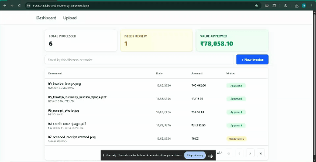

# Invoice Intake and Review System

**An AI-powered full-stack application for extracting, validating, and reviewing invoice data with automated workflow assignment.**


---

## 📋 Overview

A full-stack web application that streamlines invoice processing by automating data extraction, validation, and review workflows. Users can upload invoices as files (PDF, PNG, JPG) or paste raw text. The system extracts key fields (vendor, invoice number, date, amount), validates them against business rules, uses **Google Gemini API** for intelligent summaries and classification, and automatically assigns a workflow status (Pending Review, Approved, Flagged for Manual Review). All documents and changes are stored in MongoDB for successful retrieval of data.

**Ideal for:** Entry-level portfolio projects, learning full-stack development, understanding AI integration, or as a foundation for document processing workflows.

---

## 🎬 Demo

   

   Live Link:
   [https://invoice-intake-and-review-system.vercel.app](https://invoice-intake-and-review-system.vercel.app)

---

## 📑 Table of Contents

- [Features](#-features)
- [Tech Stack](#-tech-stack)
- [Project Structure](#-project-structure)
- [Usage](#-usage)
- [Roadmap](#-roadmap--future-improvements)
- [Contact](#-contact--author)

---

## ✨ Features

- **📤 Multi-format Input:** Upload PDF, PNG, JPG files or paste raw invoice text
- **🤖 AI-Powered Extraction:** Google Gemini API extracts vendor, invoice number, date, and amount
- **✅ Smart Validation:** Business rule validation with detailed feedback on data quality
- **📊 Intelligent Classification:** Automatic document classification (Invoice, Receipt, etc.) with confidence scores
- **⚠️ Risk Detection:** Identifies potential issues (missing fields, format anomalies, etc.)
- **🔄 Workflow Assignment:** Automatically assigns status (Pending Review, Approved, Flagged) based on validation
- **📝 Editable Review:** Users can correct extracted data before final approval
- **🔍 Search & Filter:** Full-text search across documents by title, vendor, invoice number, or status
- **📄 Pagination:** Efficient browsing with configurable page sizes
- **☁️ Cloud Storage:** Supports both local file storage and Cloudinary for production deployments
- **🔐 Secure API:** CORS-protected endpoints with environment-based configuration
- **⚡ Fallback Logic:** Graceful degradation if Gemini API quota is exceeded

---

## 🛠️ Tech Stack

### Frontend
- **React** 18.3+ — UI component library
- **Vite** 5.4+ — Fast build tool & dev server
- **Tailwind CSS** 4.3+ — Utility-first styling with `@tailwindcss/vite` plugin
- **React Router** 7.18+ — Client-side routing
- **PDF.js** 6.2+ — PDF rendering in the browser
- **React Hot Toast** 2.5+ — Toast notifications

### Backend
- **FastAPI** 0.111+ — Modern, fast web framework
- **Uvicorn** 0.30+ — ASGI server
- **Pydantic** 2.13+ — Data validation & settings management
- **PyMongo** 4.7+ — MongoDB driver
- **Google Generative AI** 2.14+ — Gemini API integration
- **Cloudinary** 1.41+ — Cloud file storage (in production)
- **Python Multipart** 0.0.9 — Form data parsing

### Database
- **MongoDB** — NoSQL document store for invoices, extracted fields, validation results, and workflow status

### Tools & DevOps
- **Python Dotenv** — Environment variable management
- **HTTPX** — Async HTTP client
- **Git / GitHub** — Version control
- **Vercel** — For Frontend deployment 
- **Render** — For Backend deployment 

---

## 📁 Project Structure

```
Invoice-Intake-and-Review-System/
├── frontend/                          # React + Vite frontend
│   ├── public/                        # Static assets
│   ├── src/
│   │   ├── pages/                     # React pages (Upload.jsx, Dashboard.jsx, ReviewDocument.jsx, etc.)
│   │   ├── components/                # Reusable React components
│   │   ├── api.js                     # API client functions (submitDocument, fetchHistory, etc.)
│   │   ├── App.jsx                    # Main app routing
│   │   ├── main.jsx                   # React entry point
│   │   └── styles.css                 # Global styles
│   ├── index.html                     # HTML template
│   ├── vite.config.js                 # Vite configuration
│   ├── package.json                   # Frontend dependencies
│   └── .env.example                   # Environment template
│
├── backend/                           # FastAPI backend
│   ├── app/
│   │   ├── main.py                    # FastAPI app setup, CORS, static file mounting
│   │   ├── config.py                  # Settings & environment variables (Pydantic)
│   │   ├── api/
│   │   │   ├── router.py              # Main API router aggregation
│   │   │   ├── documents.py           # Document CRUD routes (POST, GET, PATCH)
│   │   │   └── health.py              # Health check route
│   │   ├── db/
│   │   │   └── mongo.py               # MongoDB client & connection helpers
│   │   ├── services/
│   │   │   ├── llm.py                 # Google Gemini API wrapper & fallback logic
│   │   │   ├── validation.py          # Field validation rules
│   │   │   ├── workflow.py            # Workflow status assignment logic
│   │   │   └── storage.py             # File storage (local or Cloudinary)
│   │   ├── schemas/
│   │   │   └── document.py            # Pydantic models for documents, validation, LLM output
│   │   └── utils/
│   │       ├── dates.py               # Date normalization (dd/mm/yyyy format)
│   │       └── serialization.py       # MongoDB ObjectId serialization
│   ├── uploads/                       # Local file uploads (created at runtime)
│   ├── requirements.txt                # Python dependencies
│   ├── .env.example                   # Environment template
│   └── .gitkeep                       # Ensures uploads/ is tracked
│
├── .gitignore                         # Ignores node_modules, .env, __pycache__, uploads/*
├── README.md                          # This file
└── package.json                       # Root package.json (optional, for shared dependencies)
```

---


## 💻 Usage

### Running in Development

1. **Terminal 1 — Backend:**
   ```bash
   cd backend
   source venv/bin/activate  # or .\venv\Scripts\activate on Windows
   uvicorn app.main:app --reload
   ```

2. **Terminal 2 — Frontend:**
   ```bash
   cd frontend
   npm run dev
   ```

3. **Open in Browser:**
   Navigate to `http://localhost:5173`


### Using the Application

1. **Upload an Invoice:**
   - Paste raw invoice text OR upload a file (PDF, PNG, JPG)
   - Click "Process"

2. **Review Extracted Data:**
   - The system displays extracted fields (vendor, invoice number, date, amount)
   - Review the AI-generated summary and classification
   - Check for any flagged risks

3. **Approve or Edit:**
   - Edit any field if needed
   - Click "Approve" to finalize

4. **View History:**
   - Browse all processed documents
   - Search by vendor, invoice number, or status
   - Sort by date, amount, or vendor

---


### Folder-by-Folder Explanation

#### `backend/app/api/`
Contains route handlers:
- `documents.py` — CRUD operations for invoices (Create, Read, Update)
- `health.py` — Health check endpoint
- `router.py` — Aggregates all routes under `/api` prefix

#### `backend/app/services/`
Business logic:
- `llm.py` — Integrates with Google Gemini, handles API fallbacks
- `validation.py` — Validates extracted fields against rules
- `workflow.py` — Determines workflow status based on validation & LLM confidence
- `storage.py` — Manages local and Cloudinary file uploads

#### `backend/app/db/`
Data access:
- `mongo.py` — MongoDB client management, lazy initialization, collection helpers

#### `backend/app/schemas/`
Data models (Pydantic):
- `document.py` — Defines structures for documents, extracted fields, validation results, LLM output

#### `backend/app/utils/`
Utilities:
- `dates.py` — Converts dates to `dd/mm/yyyy` format consistently
- `serialization.py` — Converts MongoDB ObjectId to string for JSON responses

#### `frontend/src/pages/`
Full-page React components:
- `Upload.jsx` — File/text upload form
- `Dashboard.jsx` — Document history & search
- `ReviewDocument.jsx` — Review & edit extracted data

#### `frontend/src/components/`
Reusable UI components (e.g., forms, tables, modals)

---

## 🚀 Roadmap & Future Improvements

- [ ] **Batch Processing** — Upload multiple invoices at once for bulk processing
- [ ] **Email Integration** — Auto-send approved invoices to vendor email or accounting system
- [ ] **Advanced OCR** — Switch from Gemini to specialized OCR for better extraction accuracy on complex layouts
- [ ] **User Authentication** — Add login/roles (Admin, Reviewer, Viewer) for multi-user workflows
- [ ] **Webhook Support** — Notify external systems (ERPs, accounting software) on document approval
- [ ] **Dark Mode** — Add dark theme toggle for accessibility
- [ ] **Duplicate Detection** — Flag potential duplicate invoices based on vendor + amount
- [ ] **Export Reports** — Generate PDF or CSV reports of processed invoices for audit trails
- [ ] **Retry Logic** — Auto-retry LLM calls on transient failures (429, 5xx errors)
- [ ] **Docker Compose** — Add docker-compose.yml for one-command local setup with MongoDB

---

## 👋 Contact & Author

**Developer:** Mohd Zubair

- **Email:** mailzubair.2020@gmail.com
- **LinkedIn:** [linkedin.com/in/mzubairq](https://linkedin.com/in/mzubairq)
- **GitHub:** [@Phenomenal46](https://github.com/Phenomenal46)

### Questions or Issues?

- Open a [GitHub Issue](https://github.com/Phenomenal46/Invoice-Intake-and-Review-System/issues) for bugs or feature requests
- Reach out via email for freelance or collaboration inquiries

---

**Built with ❤️ using React, FastAPI, and MongoDB.**
